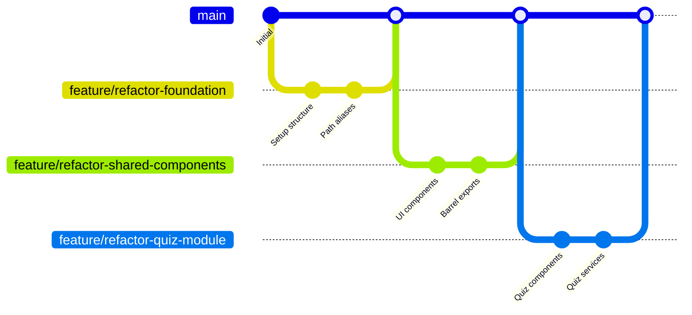

# Design Document

## Overview

This design outlines a comprehensive refactoring strategy for the Thai online fraud awareness quiz application. The current Next.js 15 application has a functional but disorganized structure that needs systematic reorganization to improve maintainability, scalability, and developer experience. The refactoring will be implemented through a phased git branching approach to ensure safe deployment and rollback capabilities.

## Architecture

### Current State Analysis

The application currently has:
- Mixed component organization (some in `/components`, some in `/app` subdirectories)
- Inconsistent import patterns using `@/` alias
- Feature-specific components scattered across different directories
- Shared utilities and types in `/lib` but not well-organized
- No clear separation between UI components and business logic components

### Target Architecture

```
src/
├── app/                          # Next.js App Router pages
│   ├── (auth)/                   # Route groups for auth pages
│   ├── (quiz)/                   # Route groups for quiz flow
│   └── (admin)/                  # Route groups for admin
├── features/                     # Feature-based modules
│   ├── quiz/                     # Quiz feature module
│   │   ├── components/           # Quiz-specific components
│   │   ├── hooks/               # Quiz-specific hooks
│   │   ├── services/            # Quiz business logic
│   │   ├── types/               # Quiz-specific types
│   │   └── index.ts             # Barrel exports
│   ├── admin/                   # Admin feature module
│   │   ├── components/
│   │   ├── hooks/
│   │   ├── services/
│   │   └── index.ts
│   └── survey/                  # Survey feature module
├── shared/                      # Shared across features
│   ├── components/              # Reusable UI components
│   │   ├── ui/                  # Base UI components
│   │   ├── layout/              # Layout components
│   │   └── common/              # Common business components
│   ├── hooks/                   # Shared hooks
│   ├── services/                # Shared services
│   ├── types/                   # Global types
│   ├── constants/               # Application constants
│   ├── utils/                   # Utility functions
│   └── lib/                     # External library configurations
├── assets/                      # Static assets
│   ├── images/
│   ├── icons/
│   └── fonts/
└── config/                      # Configuration files
    ├── database.ts
    ├── supabase.ts
    └── env.ts
```

## Components and Interfaces

### Feature Module Structure

Each feature module will follow a consistent internal structure:

```typescript
// features/quiz/index.ts - Barrel exports
export * from './components';
export * from './hooks';
export * from './services';
export * from './types';

// features/quiz/types/index.ts
export interface QuizState {
  currentQuestion: number;
  answers: Record<string, string>;
  score: number;
}

// features/quiz/services/quiz.service.ts
export class QuizService {
  async getQuestions(): Promise<QuizQuestion[]> { }
  async submitAnswers(answers: QuizAnswers): Promise<QuizResult> { }
}
```

### Shared Component Organization

```typescript
// shared/components/ui/index.ts - UI Component barrel
export { Button } from './button';
export { Input } from './input';
export { Card } from './card';

// shared/components/layout/index.ts - Layout components
export { Header } from './header';
export { Sidebar } from './sidebar';
export { Footer } from './footer';

// shared/components/common/index.ts - Business components
export { LoadingSpinner } from './loading-spinner';
export { ErrorBoundary } from './error-boundary';
```

### Path Alias Configuration

```typescript
// tsconfig.json paths update
{
  "paths": {
    "@/*": ["./src/*"],
    "@/features/*": ["./src/features/*"],
    "@/shared/*": ["./src/shared/*"],
    "@/app/*": ["./src/app/*"],
    "@/assets/*": ["./src/assets/*"],
    "@/config/*": ["./src/config/*"]
  }
}
```

## Data Models

### Type Organization Strategy

```typescript
// shared/types/index.ts - Global types
export interface User {
  id: string;
  email: string;
  role: UserRole;
}

export interface ApiResponse<T> {
  data: T;
  error?: string;
  success: boolean;
}

// features/quiz/types/index.ts - Quiz-specific types
export interface QuizQuestion {
  id: string;
  question: string;
  content: QuizContent;
  answers: Answer[];
  category: ScamCategory;
}

// shared/types/database.ts - Database types
export type Database = {
  // Supabase generated types
}
```

### Migration Strategy for Existing Types

1. **Phase 1**: Move global types to `shared/types/`
2. **Phase 2**: Move feature-specific types to respective feature modules
3. **Phase 3**: Update all imports to use new paths
4. **Phase 4**: Remove old type files

## Error Handling

### Centralized Error Management

```typescript
// shared/services/error.service.ts
export class ErrorService {
  static handleApiError(error: unknown): ApiError {
    // Centralized error handling logic
  }
  
  static logError(error: Error, context: string): void {
    // Error logging logic
  }
}

// shared/components/common/error-boundary.tsx
export class ErrorBoundary extends Component {
  // Global error boundary implementation
}
```

### Feature-Level Error Handling

```typescript
// features/quiz/services/error-handler.ts
export const handleQuizError = (error: unknown) => {
  return ErrorService.handleApiError(error);
};
```

## Testing Strategy

### Test Organization Structure

```
src/
├── features/
│   └── quiz/
│       ├── __tests__/
│       │   ├── components/
│       │   ├── hooks/
│       │   └── services/
│       └── components/
└── shared/
    ├── __tests__/
    │   ├── components/
    │   ├── hooks/
    │   └── utils/
    └── components/
```

### Testing Patterns

```typescript
// features/quiz/__tests__/services/quiz.service.test.ts
describe('QuizService', () => {
  describe('getQuestions', () => {
    it('should fetch quiz questions successfully', async () => {
      // Test implementation
    });
  });
});

// shared/__tests__/components/ui/button.test.tsx
describe('Button Component', () => {
  it('should render with correct variant', () => {
    // Test implementation
  });
});
```

## Git Branching Strategy

### Branch Naming Convention

```
feature/refactor-{module-name}
├── feature/refactor-shared-components
├── feature/refactor-quiz-module
├── feature/refactor-admin-module
├── feature/refactor-path-aliases
└── feature/refactor-build-optimization
```

### Phased Implementation Plan

#### Phase 1: Foundation Setup
- **Branch**: `feature/refactor-foundation`
- Create new directory structure
- Set up path aliases
- Move shared utilities and types

#### Phase 2: Shared Components Migration
- **Branch**: `feature/refactor-shared-components`
- Reorganize UI components
- Create barrel exports
- Update import paths

#### Phase 3: Feature Module Creation
- **Branch**: `feature/refactor-quiz-module`
- **Branch**: `feature/refactor-admin-module  
- **Branch**: `feature/refactor-survey-module`
- Extract feature-specific components
- Create feature services and hooks

#### Phase 4: Path Optimization
- **Branch**: `feature/refactor-path-aliases`
- Update all import statements
- Implement consistent import patterns
- Remove old file references

#### Phase 5: Build Optimization
- **Branch**: `feature/refactor-build-optimization`
- Implement code splitting
- Add lazy loading
- Optimize bundle size

### Merge Strategy



## Performance Considerations

### Code Splitting Strategy

```typescript
// app/quiz/page.tsx - Lazy loading
const QuizClient = lazy(() => import('@/features/quiz/components/quiz-client'));

// features/quiz/components/index.ts - Dynamic imports
export const QuizScenario = lazy(() => import('./quiz-scenario'));
export const QuizResult = lazy(() => import('./quiz-result'));
```

### Bundle Optimization

```typescript
// next.config.ts - Webpack optimization
const nextConfig = {
  webpack: (config) => {
    config.optimization.splitChunks = {
      chunks: 'all',
      cacheGroups: {
        vendor: {
          test: /[\\/]node_modules[\\/]/,
          name: 'vendors',
          chunks: 'all',
        },
        quiz: {
          test: /[\\/]features[\\/]quiz[\\/]/,
          name: 'quiz',
          chunks: 'all',
        },
        admin: {
          test: /[\\/]features[\\/]admin[\\/]/,
          name: 'admin',
          chunks: 'all',
        },
      },
    };
    return config;
  },
};
```

### Asset Optimization

```typescript
// shared/utils/image.ts - Image optimization utilities
export const optimizeImage = (src: string, width?: number) => {
  return `${src}?w=${width}&q=75&f=webp`;
};

// Asset loading strategy
const images = {
  logo: () => import('@/assets/images/logo.svg'),
  cover: () => import('@/assets/images/cover-01.svg'),
};
```

## Migration Checklist

### Pre-Migration Validation
- [ ] All tests passing
- [ ] Build successful
- [ ] No TypeScript errors
- [ ] Performance baseline established

### Post-Migration Validation
- [ ] All imports resolved correctly
- [ ] Bundle size within acceptable limits
- [ ] No circular dependencies
- [ ] All features functional
- [ ] Performance maintained or improved

### Rollback Strategy
- Maintain feature flags for gradual rollout
- Keep old structure in parallel during transition
- Automated testing for each migration phase
- Database backup before any data-related changes