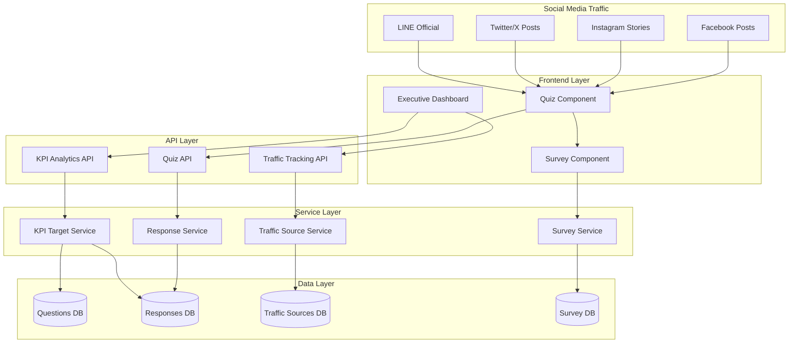
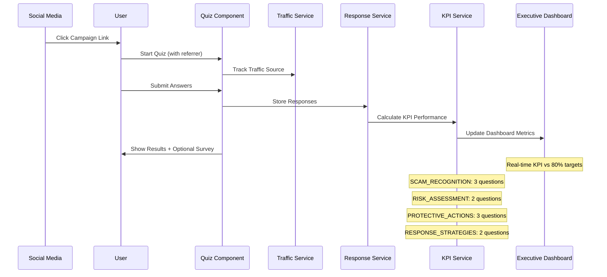
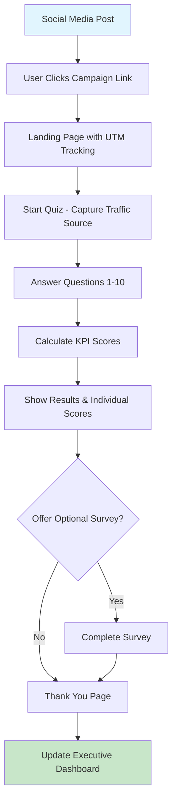
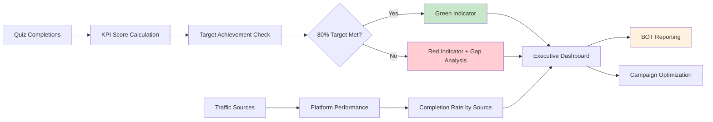
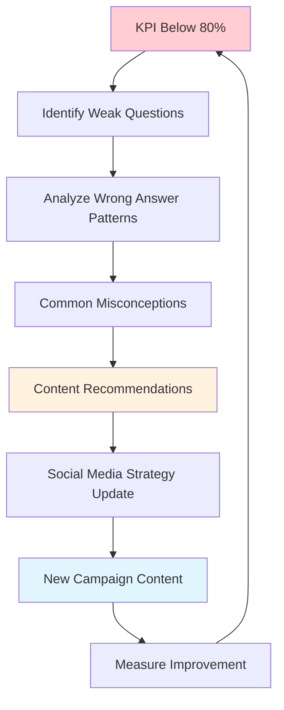

# Design Document: Media Fund Content Effectiveness System

## Overview

The Media Fund Content Effectiveness System measures the success of scam awareness campaigns by tracking quiz responses from social media traffic. The system focuses on demonstrating that content achieves 80% success rates across 4 KPI categories, providing clear reporting for Bank of Thailand stakeholders while supporting campaign optimization through analytics.

## Architecture

### System Components



### Campaign Flow Architecture



## Components and Interfaces

### 1. Traffic Source Tracking Component

**Purpose:** Track and categorize users from different social media campaigns

**Key Methods:**
- `captureReferrer(url, campaignId, platform)`
- `trackUserJourney(sessionId, source, completionStatus)`
- `getTrafficAnalytics(dateRange, platform)`

**Integration Points:**
- Social media campaign links with UTM parameters
- Quiz component initialization
- Executive dashboard reporting

### 2. KPI Target Achievement Service

**Purpose:** Calculate and monitor KPI performance against 80% targets

**Key Methods:**
- `calculateKPISuccess(category, responses)`
- `checkTargetAchievement(kpiCategory, threshold=0.8)`
- `getKPIStatusDashboard()`

**KPI Categories & Targets:**
1. **SCAM_RECOGNITION** (3 questions) - Target: 80% success rate
2. **RISK_ASSESSMENT** (2 questions) - Target: 80% success rate  
3. **PROTECTIVE_ACTIONS** (3 questions) - Target: 80% success rate
4. **RESPONSE_STRATEGIES** (2 questions) - Target: 80% success rate

### 3. Executive Dashboard Service

**Purpose:** Provide clear success metrics for BOT reporting

**Key Methods:**
- `getExecutiveSummary()`
- `getKPITargetStatus()`
- `getCampaignEffectiveness()`
- `generateBOTReport(format)`

**Dashboard Metrics:**
- Total completed responses
- KPI success rates vs. 80% targets (green/red indicators)
- Traffic source performance
- Overall campaign effectiveness score

### 4. Content Gap Analysis Service

**Purpose:** Identify areas needing additional media content

**Key Methods:**
- `identifyWeakKPIs(threshold=0.8)`
- `getCommonMisconceptions(kpiCategory)`
- `suggestContentPriorities()`
- `analyzeWrongAnswerPatterns()`

## Data Models

### Campaign-Focused Database Schema

```sql
-- Traffic Sources Table
CREATE TABLE traffic_sources (
    id UUID PRIMARY KEY DEFAULT gen_random_uuid(),
    platform VARCHAR(50) NOT NULL, -- 'facebook', 'instagram', 'twitter', 'line'
    campaign_id VARCHAR(100),
    utm_source VARCHAR(100),
    utm_medium VARCHAR(100),
    utm_campaign VARCHAR(100),
    created_at TIMESTAMPTZ DEFAULT NOW()
);

-- Quiz Sessions Table (simplified for campaign tracking)
CREATE TABLE quiz_sessions (
    id UUID PRIMARY KEY DEFAULT gen_random_uuid(),
    session_id TEXT NOT NULL UNIQUE,
    traffic_source_id UUID REFERENCES traffic_sources(id),
    anonymous_user_id TEXT, -- browser localStorage ID
    
    -- Quiz completion data
    total_questions INTEGER DEFAULT 10,
    completed_questions INTEGER DEFAULT 0,
    correct_answers INTEGER DEFAULT 0,
    is_completed BOOLEAN DEFAULT FALSE,
    completion_time_ms INTEGER,
    
    -- KPI breakdown (denormalized for performance)
    scam_recognition_score DECIMAL(3,2), -- e.g., 0.67 for 2/3
    risk_assessment_score DECIMAL(3,2),  -- e.g., 1.00 for 2/2
    protective_actions_score DECIMAL(3,2), -- e.g., 0.33 for 1/3
    response_strategies_score DECIMAL(3,2), -- e.g., 0.50 for 1/2
    
    created_at TIMESTAMPTZ DEFAULT NOW(),
    expires_at TIMESTAMPTZ DEFAULT (NOW() + INTERVAL '45 days')
);

-- Individual Question Responses
CREATE TABLE question_responses (
    id UUID PRIMARY KEY DEFAULT gen_random_uuid(),
    quiz_session_id UUID REFERENCES quiz_sessions(id) ON DELETE CASCADE,
    question_id UUID REFERENCES questions(id),
    selected_answer_id UUID REFERENCES answers(id),
    is_correct BOOLEAN NOT NULL,
    response_time_ms INTEGER,
    
    -- Denormalized for analytics
    kpi_category VARCHAR(50) NOT NULL,
    question_order INTEGER,
    
    created_at TIMESTAMPTZ DEFAULT NOW()
);

-- Optional Survey Responses
CREATE TABLE survey_responses (
    id UUID PRIMARY KEY DEFAULT gen_random_uuid(),
    quiz_session_id UUID REFERENCES quiz_sessions(id) ON DELETE CASCADE,
    
    -- Demographics (optional)
    age_range VARCHAR(20),
    education_level VARCHAR(50),
    occupation_type VARCHAR(50),
    
    -- Feedback
    content_helpfulness INTEGER CHECK (content_helpfulness BETWEEN 1 AND 5),
    difficulty_rating INTEGER CHECK (difficulty_rating BETWEEN 1 AND 5),
    additional_feedback TEXT,
    
    created_at TIMESTAMPTZ DEFAULT NOW()
);

-- KPI Target Configuration
CREATE TABLE kpi_targets (
    id UUID PRIMARY KEY DEFAULT gen_random_uuid(),
    kpi_category VARCHAR(50) NOT NULL UNIQUE,
    target_percentage DECIMAL(3,2) DEFAULT 0.80, -- 80% target
    total_questions INTEGER NOT NULL,
    description TEXT,
    is_active BOOLEAN DEFAULT TRUE,
    created_at TIMESTAMPTZ DEFAULT NOW()
);

-- Insert KPI targets
INSERT INTO kpi_targets (kpi_category, target_percentage, total_questions, description) VALUES
('SCAM_RECOGNITION', 0.80, 3, 'Ability to identify fraudulent content'),
('RISK_ASSESSMENT', 0.80, 2, 'Evaluating potential threats and dangers'),
('PROTECTIVE_ACTIONS', 0.80, 3, 'Knowledge of preventive measures'),
('RESPONSE_STRATEGIES', 0.80, 2, 'Appropriate reactions to scam attempts');
```

### TypeScript Interfaces

```typescript
// Campaign Traffic Interface
interface TrafficSource {
  id: string;
  platform: 'facebook' | 'instagram' | 'twitter' | 'line';
  campaignId?: string;
  utmSource?: string;
  utmMedium?: string;
  utmCampaign?: string;
  createdAt: Date;
}

// Quiz Session Interface
interface QuizSession {
  id: string;
  sessionId: string;
  trafficSourceId?: string;
  anonymousUserId?: string;
  
  totalQuestions: number;
  completedQuestions: number;
  correctAnswers: number;
  isCompleted: boolean;
  completionTimeMs?: number;
  
  // KPI Scores (0.0 to 1.0)
  scamRecognitionScore?: number;
  riskAssessmentScore?: number;
  protectiveActionsScore?: number;
  responseStrategiesScore?: number;
  
  createdAt: Date;
}

// KPI Target Interface
interface KPITarget {
  kpiCategory: string;
  targetPercentage: number; // 0.80 for 80%
  totalQuestions: number;
  currentSuccessRate?: number;
  isTargetMet?: boolean;
}

// Executive Dashboard Interface
interface ExecutiveDashboard {
  totalCompletedSessions: number;
  totalStartedSessions: number;
  completionRate: number;
  
  kpiTargetStatus: {
    scamRecognition: KPITargetStatus;
    riskAssessment: KPITargetStatus;
    protectiveActions: KPITargetStatus;
    responseStrategies: KPITargetStatus;
  };
  
  trafficSourcePerformance: TrafficPerformance[];
  overallCampaignScore: number; // 0-100
}

interface KPITargetStatus {
  category: string;
  currentRate: number;
  targetRate: number;
  isTargetMet: boolean;
  totalResponses: number;
  improvement?: number; // vs previous period
}

interface TrafficPerformance {
  platform: string;
  totalClicks: number;
  completedQuizzes: number;
  completionRate: number;
  avgKPIScore: number;
}

// Survey Response Interface
interface SurveyResponse {
  id: string;
  quizSessionId: string;
  ageRange?: string;
  educationLevel?: string;
  occupationType?: string;
  contentHelpfulness?: number; // 1-5
  difficultyRating?: number; // 1-5
  additionalFeedback?: string;
  createdAt: Date;
}
```

## User Flow Diagrams

### Campaign User Journey



### Executive Dashboard Data Flow



### Content Gap Analysis Flow



## Error Handling

### Campaign Tracking Errors
- **Missing UTM Parameters:** Default to 'direct' traffic source with logging
- **Invalid Referrer Data:** Sanitize and store as 'unknown' source
- **Duplicate Session IDs:** Generate new unique identifier with timestamp

### KPI Calculation Errors
- **Insufficient Data:** Show "Insufficient data" message when < 10 responses
- **Missing Question Categories:** Default to 'GENERAL' category with warning
- **Target Threshold Issues:** Validate 0.0-1.0 range, default to 0.80

### Dashboard Display Errors
- **Data Loading Failures:** Show cached data with "Last updated" timestamp
- **Real-time Update Issues:** Fall back to manual refresh option
- **Export Generation Errors:** Provide partial data with error notification

### Survey Integration Errors
- **Optional Survey Failures:** Continue without survey, log error
- **Invalid Survey Data:** Validate and sanitize input, store valid fields only
- **Survey-Quiz Linking Issues:** Maintain quiz data integrity, survey optional

## Testing Strategy

### Campaign Flow Testing
- UTM parameter capture accuracy
- Traffic source attribution correctness
- Quiz completion tracking
- KPI score calculation validation

### Dashboard Testing
- Executive dashboard data accuracy
- KPI target status indicators (green/red)
- Real-time metric updates
- BOT report generation

### Performance Testing
- High-volume social media traffic handling
- Dashboard load times with 1000+ responses
- Database query optimization for analytics
- Concurrent user session management

### Data Integrity Testing
- Anonymous user ID uniqueness
- Quiz session data consistency
- KPI score calculation accuracy
- Survey data optional handling

## Implementation Phases

### Phase 1: Core Campaign Tracking
- Database schema for traffic sources and quiz sessions
- UTM parameter capture and traffic source attribution
- Basic quiz completion tracking
- KPI score calculation (4 categories: 3/2/3/2 questions)

### Phase 2: Executive Dashboard
- Dashboard UI showing completion rates and KPI targets
- Green/red indicators for 80% target achievement
- Traffic source performance metrics
- Basic BOT reporting format

### Phase 3: Content Gap Analysis
- Wrong answer pattern identification
- Common misconception tracking
- Content recommendation system
- Campaign optimization insights

### Phase 4: Survey Integration & Polish
- Optional survey component after quiz completion
- Survey data correlation with quiz performance
- Data export functionality for research
- Performance optimization and mobile responsiveness

## Success Metrics

### Primary KPIs (Must Achieve 80%)
- **SCAM_RECOGNITION**: 80% success rate across 3 questions
- **RISK_ASSESSMENT**: 80% success rate across 2 questions  
- **PROTECTIVE_ACTIONS**: 80% success rate across 3 questions
- **RESPONSE_STRATEGIES**: 80% success rate across 2 questions

### Campaign Effectiveness Metrics
- **Completion Rate**: % of users who finish all 10 questions
- **Traffic Source Performance**: Completion rates by social media platform
- **Content Engagement**: Time spent on quiz and survey participation
- **BOT Satisfaction**: Clear demonstration of campaign ROI and effectiveness