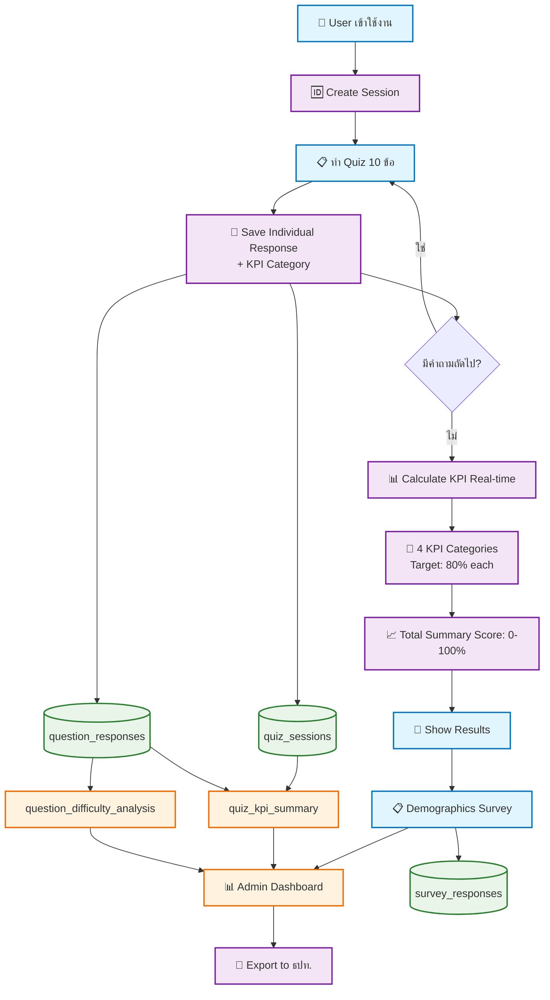
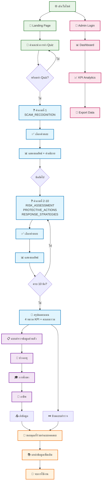
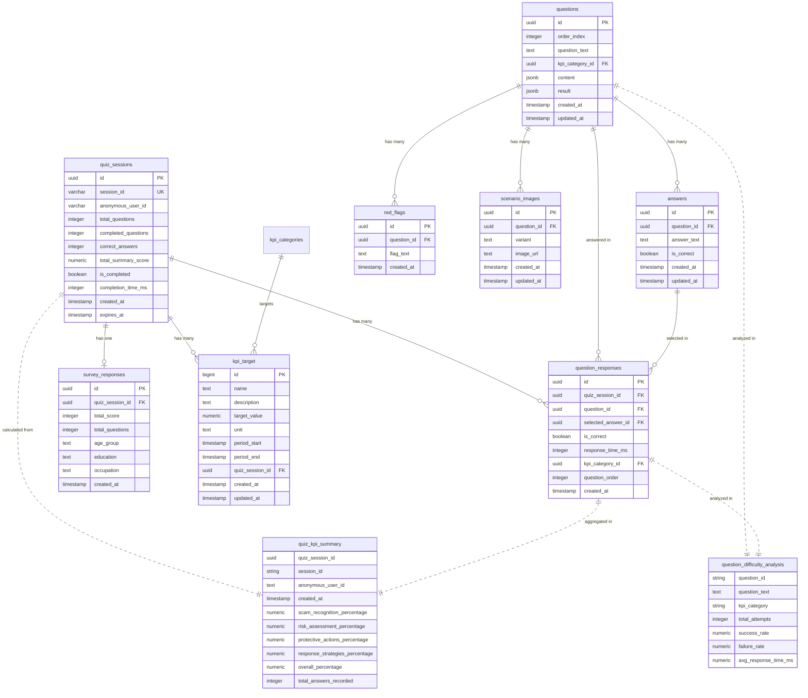
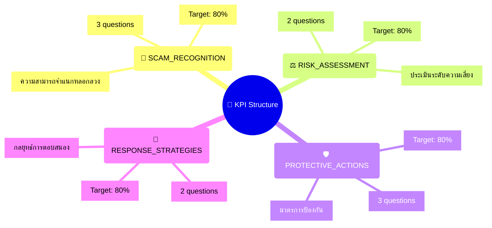
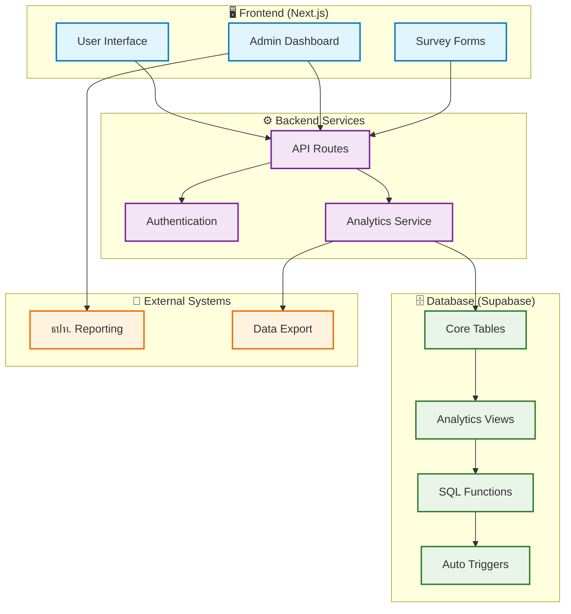

# 📊 Scam Awareness System - Complete Diagrams

## 🔄 1. Data Flow Diagram (DFD) - ระบบการทำงาน

## 👤 2. User Flow Diagram - การใช้งานของผู้ใช้

## 🗄️ 3. Entity Relationship Diagram (ERD) - โครงสร้างฐานข้อมูล

## 📋 4. KPI Categories Mapping

## 🚀 5. System Architecture Overview

---

## 📊 สรุปภาพรวมระบบ

**🎯 วัตถุประสงค์:** สร้างความตระหนักรู้เรื่อง SCAM Online และวัด KPI เพื่อส่งมอบให้ ธปท.

**👥 ผู้ใช้หลัก:** 
- ประชาชนทั่วไป (ทำ Quiz)
- ผู้ดูแลระบบ (ดู Analytics)
- ธปท. (รับรายงาน KPI)

**🔢 KPI หลัก:** 4 หมวด เป้าหมาย 80% แต่ละหมวด
- การจำแนกหลอกลวง
- การประเมินความเสี่ยง  
- มาตรการป้องกัน
- กลยุทธ์การตอบสนอง

**💾 ฐานข้อมูล:** PostgreSQL + Supabase
- ไม่ซ้ำซ้อน
- Real-time calculation
- Analytics-ready

**📊 Dashboard:** ShadCN + Recharts
- KPI monitoring
- Question analysis
- Export functionality

