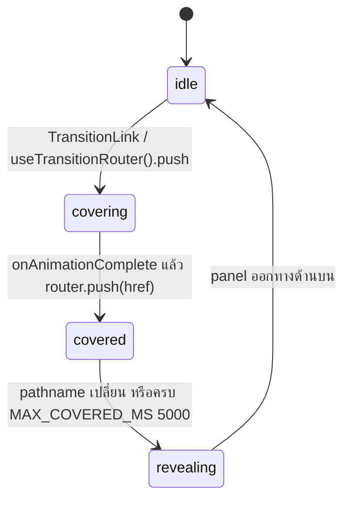

# ADR-002: Motion และ route transitions

- สถานะ: Accepted
- วันที่: 2026-09-28
- เกี่ยวข้อง: ADR-001, ADR-004 (Core Web Vitals, accessibility)

## บริบท

- แนวคิด "Scan & Flag": เลนส์สแกนหลักฐาน (scan) แล้วปักธงแดงบนจุดน่าสงสัย (flag) motion ทุกชิ้นต้องมาจากสองคำกริยานี้
- ผู้ใช้หลายคนเป็นผู้สูงอายุ และบางคนตั้ง "ลดการเคลื่อนไหว" ไว้ในเครื่อง; หลายคนเปิดผ่าน in-app browser บนมือถือราคาประหยัด
- ระบบเดิมใช้ `framer-motion` แบบ `motion.*` เต็ม bundle และมี transition หลายแบบ (`components/page-transition.tsx`, `components/stair-transition.tsx`, `lib/motion/quiz-motion.ts`)
- App Router unmount หน้าเก่าทันทีที่ route commit จึงพึ่ง exit animation ของหน้าไม่ได้

## ตัวเลือก

| ตัวเลือก | ข้อดี | ข้อเสีย | ผล |
| --- | --- | --- | --- |
| `motion/react` v12 (`m.*` + `LazyMotion`) | declarative ใน React, spring, `AnimatePresence`, `layoutId`, `useReducedMotion`, ทีมคุ้นเคย | ต้องระวัง bundle (แก้ด้วย `LazyMotion`) | **เลือก** |
| import จาก `framer-motion` | API เดียวกัน | เป็นชื่อแพ็กเกจเดิม; entry point ที่ดูแลต่อคือ `motion/react`; มีสองชื่อใน repo = สับสน | ห้าม import ใหม่ |
| GSAP | timeline ละเอียด | imperative ต้องจัดการ cleanup เอง, ไม่มี `layoutId`/exit แบบ React, เป็นระบบ animation ที่สองใน bundle | ไม่เลือก |
| CSS ล้วน (Tailwind transitions) | 0 KB JS, ทำงานบน compositor | ไม่มี spring จริง, ไม่มี exit/`layoutId`, นับเลขไม่ได้ | ใช้เฉพาะ micro (moment 8) |
| View Transitions API | native, ไม่ต้อง overlay | ใน Next.js/React ยังเป็น experimental, การรองรับใน in-app browser / WebView รุ่นเก่าไม่แน่นอน | ทบทวนภายหลัง |

## การตัดสินใจ

### Setup ทั้งแอป

- `components/motion/motion-provider.tsx` ครอบทั้งแอปใน `app/layout.tsx`: `<LazyMotion features={domMax}>` + `<MotionConfig reducedMotion="user">`
- โค้ดใหม่ใช้ `m.*` เท่านั้น และ import จาก `"motion/react"` (`domMax` จำเป็นเพราะ Progress Rail ใช้ `layoutId`)
- `reducedMotion="user"`: เมื่อเครื่องขอลดการเคลื่อนไหว transform/layout จะถูกข้าม แต่ opacity/สียังเปลี่ยน ซึ่งเป็น fallback ที่ออกแบบไว้ของทุก preset; moment ที่เป็นของตกแต่งล้วน (Scan Reveal, นับคะแนน, เข็มมาตรวัด) เช็ก `useReducedMotion()` เองแล้วข้ามทั้งหมด
- config animation พิมพ์แบบหลวม (`any`) ตาม `AGENTS.md`; type เข้มเก็บไว้ที่ขอบเขต data/API

### Tokens: CSS และ TS ต้องตรงกัน

| Token | CSS (`app/globals.css`) | TS (`lib/motion/tokens.ts`) |
| --- | --- | --- |
| dur instant / quick / base / slow / page / scan | `--dur-*` 90 / 160 / 240 / 400 / 560 / 900ms | `DUR.*` 0.09 … 0.9 (วินาที) |
| ease settle / wipe / exit | `--ease-settle`, `--ease-wipe`, `--ease-exit` | `EASE.settle`, `EASE.wipe`, `EASE.exit` |
| springs press / pin / sheet / layout | ไม่มี (code only) | `SPRING.*` |
| stagger lists / pins | ไม่มี | `STAGGER.list` 0.06, `STAGGER.pins` 0.08 |

ยังไม่มี test ที่บังคับให้สองไฟล์ตรงกัน: ขั้นต่อไปคือเพิ่ม test ที่อ่าน `--dur-*` / `--ease-*` จาก `globals.css` แล้วเทียบกับ `DUR` / `EASE`

### The 8 moments (นอกจากนี้ไม่มีอะไรขยับ)

| # | Moment | Implementation | Reduced motion |
| --- | --- | --- | --- |
| 1 | Scan Wipe (route transition) | `components/motion/scan-transition.tsx`, `wipePanel` | ไม่มี panel, navigate ทันที; `template.tsx` ให้ fade แทน |
| 2 | Scan Reveal (scenario เข้า) | `components/motion/scan-reveal.tsx`, `scanSweep`; ใช้ใน `ScenarioFrame` และ cover หน้าแรก | ไม่ render band เลย |
| 3 | Flag Plant | `components/ds/red-flag-pin.tsx`: `flagPlant` (spring pin, stagger 80ms) + `pinPulse` | fade อย่างเดียว |
| 4 | Answer feedback | `components/ds/answer-option.tsx` (`pressable`, `wrongNudge`), `status-icon.tsx` (`iconDraw`) | เปลี่ยนสีอย่างเดียว |
| 5 | Result sheet | `components/ds/result-sheet.tsx`: `sheetUp`, `scrimFade`, `staggerChildren` | fade |
| 6 | Progress rail | `components/ds/progress-rail.tsx`: `layoutId="progress-rail-indicator"`, `railIndicator` | กระโดดไปตำแหน่งใหม่ |
| 7 | Score + risk meter | `score-numeral.tsx` นับ 800ms (`DUR.slow * 2`), `risk-meter.tsx` เข็มหมุนเมื่อ `useInView` | แสดงค่าสุดท้ายทันที; ตัวเลขประกาศผ่าน live region หลังนับเสร็จ |
| 8 | Micro (CTA) | `components/ds/button.tsx` CSS: `hover:-translate-y-0.5`, `active:translate-y-0.5` + ledge | `motion-reduce:transform-none` |

### Scan Wipe: design

- panel `bg-navy-800` + เส้นสแกน `bg-screen-300` สูง 2px ที่ขอบนำ, `z-(--layer-transition)`, ข้อความ "กำลังสแกน…", `aria-hidden`
- ขาเข้า/ขาออก = `DUR.page` 560ms + `EASE.wipe`; ขณะ idle panel เป็น `invisible pointer-events-none`
- ข้าม wipe และ navigate ตรงเมื่อ: reduced motion, ไปหน้าเดิม, คนละ origin, คลิกพร้อม modifier / ปุ่มอื่น, `target` ไม่ใช่ `_self`
- back/forward และ `<Link>` ธรรมดาไม่ wipe: `app/(main)/template.tsx` ให้ `fadeUp` แทน
- fail-safe: หน้าจอไม่ถูกปิดค้างเกิน 5 วินาที แม้ route ไม่ commit

### กฎ LCP

- เนื้อหาหลักที่ server render ต้องไม่เริ่มที่ `opacity: 0`
- `template.tsx` ใช้ flag ระดับ module (`hasHydrated`): paint แรกจาก server ไม่ animate; เฉพาะการนำทางฝั่ง client ครั้งถัดไปเท่านั้นที่ `fadeUp`
- Scan Reveal เป็น overlay `absolute` เหนือเนื้อหาที่มองเห็นครบแล้ว จึงไม่กระทบ LCP และ CLS
- ห้ามซ่อน hero/cover หน้าแรกเพื่อรอ animation (`app/(main)/page.tsx`)

## Performance budget

- animate เฉพาะ `transform` และ `opacity` (compositor); ข้อยกเว้นเดียวคือ FLIP ของ `layoutId` ใน Progress Rail
- ≤ 1 animation เต็มจอพร้อมกัน; ทุก moment ≤ 560ms ยกเว้น Scan Reveal (900ms, ตกแต่ง, ไม่บล็อก input) และนับคะแนน (800ms)
- ไม่มี animation ใดทำให้ layout ขยับ: เป้าหมาย CLS จาก motion = 0; press feedback ไม่รอ animation จบก่อนตอบสนอง (INP)
- JS: `m` + `LazyMotion` แทน `motion.*`; ขั้นต่อไปคือโหลด `domMax` แบบ async (`features={() => import(...)}`) และเปิด `strict` ใน `LazyMotion` เมื่อไม่เหลือ `motion.*` ในหน้า public
- ห้ามใช้ `framer-motion` ใน route public ใหม่: ปัจจุบัน `app/(main)/quiz/_component/*` และ `components/red-flag-overlay.tsx`, `content-area.tsx` (ที่ quiz เดิมใช้) ยัง import อยู่ และ `motion.*` ใน `LazyMotion` ที่ไม่ strict จะดึง feature bundle เต็มมาด้วย; `components/page-transition.tsx`, `stair-transition.tsx`, `stairs.tsx` ไม่มีใคร import แล้ว ลบได้

## ผลที่ตามมา

- ข้อดี: motion มี inventory ชัด ตรวจ code review ง่าย ("นี่คือ moment ไหน?")
- ข้อดี: reduced motion ได้ผลทั้งแอปจากจุดเดียว
- ข้อเสีย: Scan Wipe เป็น overlay ของเราเอง ต้องดูแลกรณีขอบ (timeout, back/forward) เอง
- ข้อเสีย: spec กำหนด reduced motion ของ Scan Wipe เป็น crossfade 120ms แต่ปัจจุบันได้ fade 240ms (`fadeUp` ผ่าน `template.tsx`); ปรับได้ถ้าจำเป็น
- ติดตาม: ถอด `framer-motion` ออกจาก `package.json` เมื่อหน้า quiz ย้ายเสร็จ; comment ใน `lib/motion/presets.ts` ยังอ้างชื่อไฟล์ `ADR-002-motion.md` ให้แก้เป็นไฟล์นี้
