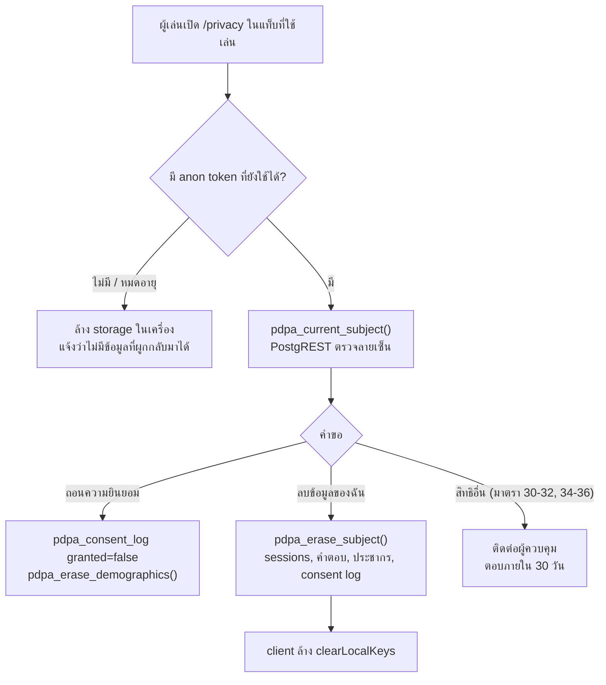

# ADR-006: การปฏิบัติตาม PDPA (พ.ร.บ.คุ้มครองข้อมูลส่วนบุคคล พ.ศ. 2562)

- สถานะ: Accepted (รอฝ่ายกฎหมายยืนยันข้อที่ระบุใน "Open items")
- วันที่: 2026-09-28
- เกี่ยวข้อง: ADR-005 (security), migration `08-pdpa-consent-retention.sql`
- เอกสารนี้เป็นบันทึกทางเทคนิค ไม่ใช่ความเห็นทางกฎหมาย

## บริบท

- ระบบเดิมเก็บข้อมูลประชากร (อายุ เพศ จังหวัด การศึกษา อาชีพ) โดยไม่มีความยินยอมแยก, ไม่มีประกาศความเป็นส่วนตัว, ไม่มีระยะเวลาเก็บ และลบข้อมูลไม่ได้
- ผู้เล่นไม่มีบัญชี: ตัวตนเดียวคือรหัสสุ่ม `anonymous_user_id` (`user_<uuid>`) ผูกกับแท็บเบราว์เซอร์ผ่าน anon JWT (ADR-005)

## การตัดสินใจ

- **แหล่งความจริงเดียว** `lib/privacy/policy.ts`: `POLICY_VERSION` (`2026-09-28`), `LAWFUL_BASES`, `PURPOSES`, `DATA_INVENTORY`, `RETENTION`, `RETENTION_JOB`, `CLIENT_STORAGE`, `PROCESSORS`, `CONTROLLER`, `SUPERVISORY_AUTHORITY`
- หน้าประกาศ `/privacy`, ConsentPanel, Server Actions และ SQL อ่านค่าจากไฟล์นี้; `__tests__/privacy/policy.test.ts` ตรวจว่า interval ใน SQL ตรงกับ `RETENTION` และ storage key ตรงกับ service ที่เขียนจริง

### PDPA mapping

| มาตรา | ข้อกำหนด | วิธีปฏิบัติ | ไฟล์ |
| --- | --- | --- | --- |
| 19 | ความยินยอมชัดแจ้ง แยกเรื่อง ไม่เป็นเงื่อนไขการใช้บริการ ถอนได้ง่ายเท่าตอนให้ | สวิตช์แยกต่อ purpose ค่าเริ่มต้นปิด, ข้าม survey ได้และผลลัพธ์ไม่ขึ้นกับมัน, บันทึกลง consent log ก่อนเก็บข้อมูล, ปุ่มถอนที่ `/privacy#withdraw-consent` | `components/ds/consent-panel.tsx`, `app/(main)/survey/_components/survey-form.tsx`, `lib/actions/privacy.ts` |
| 20 | ผู้เยาว์ (อายุต่ำกว่า 20) | ช่วงอายุ `under-15` / `15-19`: ไม่เก็บอะไรเลยและไม่บันทึกความยินยอม (การติ๊กยินยอมของผู้เยาว์เองไม่ใช่ความยินยอมที่สมบูรณ์ตามมาตรา 20) ข้อมูลอื่นถูกทิ้งโดยไม่ validate | `lib/privacy/survey.ts` (`isMinorAgeBand`), `lib/actions/survey.ts`, `survey-form.tsx` |
| 21 | ใช้ตามวัตถุประสงค์ที่แจ้ง | ทุก consent เก็บ `policy_version`; เปลี่ยนสาระสำคัญต้อง bump `POLICY_VERSION` แล้วขอใหม่ (`code: policy_outdated`) | `lib/privacy/policy.ts`, `lib/actions/survey.ts` |
| 22 | เก็บเท่าที่จำเป็น | ไม่ถามชื่อ เบอร์ อีเมล วันเกิด ที่อยู่; ช่วงอายุแทนอายุ; option list ปิด ไม่มีข้อความอิสระ | `lib/privacy/survey.ts` |
| 23 | แจ้งรายละเอียดก่อน/ขณะเก็บ | `/privacy`: ผู้ควบคุม, ข้อมูล, วัตถุประสงค์ + ฐาน, ระยะเวลา, ผู้รับ + ต่างประเทศ, สิทธิ, ความปลอดภัย, storage, ผู้เยาว์; ConsentPanel ลิงก์ไป `/privacy` | `app/(main)/privacy/page.tsx` |
| 24(5) | ฐานประโยชน์โดยชอบด้วยกฎหมาย | quiz, สถิติไม่ระบุตัวตน, consent log, log การเชื่อมต่อ | `LAWFUL_BASES` |
| 26 | ข้อมูลอ่อนไหว | ไม่เก็บ; เพศมีเพียง `female` / `male` / `other` / `unspecified` ไม่มีเพศวิถี | migration 08 `chk_survey_responses_gender` |
| 28–29 | ส่งข้อมูลไปต่างประเทศ | ดูหัวข้อ cross-border | `PROCESSORS` |
| 30–36 | สิทธิของเจ้าของข้อมูล | ถอน + ลบ = self-service ทันที; สิทธิอื่นผ่านช่องทางผู้ควบคุม ตอบภายใน 30 วัน | `/privacy#rights` |
| 37(1) | มาตรการความปลอดภัย | ADR-005 | |
| 37(3) | ลบเมื่อพ้นระยะเวลา | pg_cron `pdpa-retention-purge` ทุกวัน 02:30 น. | migration 08 |
| 37(4) | แจ้งเหตุละเมิดภายใน 72 ชม. | runbook ด้านล่าง | เอกสารนี้ |
| 39 | บันทึกรายการกิจกรรมการประมวลผล | ตาราง ROPA ด้านล่าง | เอกสารนี้ |
| 40 | ข้อตกลงกับผู้ประมวลผล | ต้องมี DPA กับ Supabase และ Vercel | Open item |
| 41 | DPO | ขึ้นกับสถานะหน่วยงาน | Open item |
| 73 | ร้องเรียน | ลิงก์ สคส. (pdpc.or.th) | `SUPERVISORY_AUTHORITY` |

### Data inventory / ROPA

| ข้อมูล | ที่เก็บ | วัตถุประสงค์ | ฐาน | ระยะเวลา |
| --- | --- | --- | --- | --- |
| คำตอบ คะแนน เวลา | `quiz_sessions`, `question_responses` | แสดงผล, สถิติ | 24(5) | 24 เดือน แล้ว anonymise |
| รหัสสุ่ม | `sessionStorage` `anon_jwt_cache` + DB | ผูกคำตอบรอบเดียวกัน, ยืนยันตอนขอลบ | 24(5) | เบราว์เซอร์: ปิดแท็บ/24 ชม.; DB: 24 เดือน |
| ประเภทอุปกรณ์, user agent | `quiz_sessions` | ปรับหน้าจอ, สถิติ | 24(5) | user agent ลบที่ 24 เดือน |
| ข้อมูลประชากร | `survey_responses` (+ `gender`, `policy_version`) | วางแผนการสื่อสาร | 19 (ยินยอม) | 12 เดือน แล้ว roll up เป็นยอดรายเดือน |
| บันทึกความยินยอม | `pdpa_consent_log` (append-only) | พิสูจน์การใช้ข้อมูลตามที่เลือก | 24(5) | 5 ปี |
| IP, เวลา, path | log ของ Vercel / Supabase; IP ในหน่วยความจำของ issue-anon-jwt | ความปลอดภัย, แก้ปัญหา | 24(5) | ตามรอบ log ของผู้ให้บริการ |
| รหัสสุ่ม + ข้อมูลอุปกรณ์ (legacy) | `localStorage` `scan_jone_anonymous_user` | เวอร์ชันปัจจุบันไม่เขียนแล้ว | - | ลบเมื่อกด "ลบข้อมูลของฉัน" |

ผู้ควบคุม: ยังไม่ระบุ (TODO(legal)) · ผู้ประมวลผล: Supabase, Vercel · ไม่มีการขายหรือส่งต่อให้บุคคลที่สาม · ผู้เล่นทั่วไปไม่มี cookie

### Consent UX

- survey อยู่ระหว่าง quiz กับผลลัพธ์ และเป็นทางเลือก: ปุ่ม "ข้ามแบบสอบถาม" ใช้ได้เสมอ; ถ้าสวิตช์ปิด ข้อมูลไม่ออกจากเบราว์เซอร์เลย
- ConsentPanel แสดง purpose ที่ใช้ฐานอื่นเป็นข้อมูลอ่านอย่างเดียว และ purpose ที่ต้องยินยอม (`demographics`) เป็นสวิตช์แยก ค่าเริ่มต้นปิด
- ลำดับฝั่ง server (`lib/actions/survey.ts`): validate (zod) → ยืนยันตัวผ่าน `pdpa_current_subject()` → ตรวจว่า quiz session เป็นของผู้เรียก → บันทึก consent → เขียน `survey_responses` ด้วย service role (migration 08 ถอนสิทธิ์เขียนตรงจาก anon/authenticated แล้ว)
- ถอนความยินยอม: `withdrawConsent()` เพิ่มแถว `granted = false` และเรียก `pdpa_erase_demographics()` ลบข้อมูลประชากรทันที

### Retention schedule (`RETENTION` ↔ `pdpa_retention_purge()`)

| ข้อมูล | เก็บ | เมื่อครบ |
| --- | --- | --- |
| ข้อมูลประชากร | 12 เดือนนับจากส่ง | roll up เป็นยอดรายเดือนต่อมิติเดียว (`survey_demographics_monthly`, ไม่มี cross-tab) แล้วลบรายแถว |
| quiz sessions + คำตอบ | 24 เดือน | ลบ `anonymous_user_id`, `device_fingerprint`, `user_agent`, เปลี่ยน `session_id`, ตั้ง `anonymised_at` |
| consent log | 60 เดือน | ลบ (ต้องอยู่นานกว่าข้อมูลที่ครอบคลุม + อายุความเรียกร้องตามมาตรา 78) |

- job: `pdpa-retention-purge`, `30 19 * * *` UTC = 02:30 น. เวลาไทย; function เป็น `security definer`, `search_path = ''`, เรียกได้เฉพาะ `service_role`
- ตรวจผล: `select * from cron.job_run_details where jobid = (select jobid from cron.job where jobname = 'pdpa-retention-purge') order by start_time desc limit 5;`

### Data-subject rights flow

- action ทั้งหมด (`recordConsent`, `withdrawConsent`, `eraseMyData`) validate ด้วย zod, idempotent, rate limit ต่อรหัสสุ่ม และคืน typed result
- ข้อจำกัดที่แจ้งผู้ใช้แล้ว: เมื่อปิดแท็บหรือครบ 24 ชม. เราไม่มีทางรู้ว่าข้อมูลใดเป็นของผู้ใช้ จึงทำตามคำขอบางอย่างไม่ได้ ในทางกลับกันข้อมูลก็เชื่อมกลับหาตัวบุคคลไม่ได้เช่นกัน

### Cross-border transfer (มาตรา 28–29)

- Supabase และ Vercel เป็นผู้ประมวลผลนอกประเทศ; `PROCESSORS` แนะนำภูมิภาคสิงคโปร์
- ต้องทำ: ตรวจ region จริงของ Supabase project, ตั้ง Vercel Function Region ให้ตรง (เช่น `sin1`), ลงนาม DPA ของผู้ให้บริการ (มีข้อสัญญามาตรฐาน) และบันทึกฐานการส่งตามประกาศคณะกรรมการที่ออกตามมาตรา 28–29
- CDN ของ Vercel แคชเฉพาะหน้า static ที่ไม่มีข้อมูลส่วนบุคคล

### Breach response (มาตรา 37(4))

1. **0–4 ชม.**: ผู้พบเหตุแจ้งเจ้าของระบบ; จำกัดความเสียหาย (หมุน `SECRET_KEY` / JWT secret / `CRON_SECRET`, ปิด route หรือ function ที่รั่ว, เปิด Vercel Attack Challenge Mode)
2. **4–24 ชม.**: ประเมินขอบเขตจาก log ของ Supabase / Vercel: ตารางไหน กี่แถว มีข้อมูลประชากรหรือไม่ (ข้อมูลส่วนใหญ่ผูกกับรหัสสุ่มเท่านั้น)
3. **ภายใน 72 ชม. นับแต่ทราบเหตุ**: ผู้ควบคุมแจ้ง สคส. เว้นแต่ไม่มีความเสี่ยงต่อสิทธิและเสรีภาพ (บันทึกเหตุผลไว้)
4. ถ้าความเสี่ยงสูง: แจ้งเจ้าของข้อมูลพร้อมแนวทางเยียวยาโดยไม่ชักช้า; เนื่องจากไม่มีช่องทางติดต่อรายคน ให้ประกาศบนเว็บ
5. หลังเหตุ: บันทึกเหตุการณ์, root cause, แก้ ADR-005/006

## Open items สำหรับฝ่ายกฎหมาย

- [ ] ผู้ควบคุมข้อมูล: ธปท., กองทุนพัฒนาสื่อฯ หรือผู้ควบคุมร่วม? กรอก `CONTROLLER.name` / `address` / `email` (ตอนนี้แสดง "โปรดติดต่อผู้ดูแลระบบ")
- [ ] DPO (มาตรา 41) และ `CONTROLLER.dpoEmail`
- [ ] ฐานสำหรับ quiz/สถิติ: คง 24(5) พร้อมทำ LIA หรือใช้ 24(4) ภารกิจเพื่อประโยชน์สาธารณะ หากผู้ควบคุมเป็นหน่วยงานรัฐ
- [ ] ช่องทางถอนความยินยอม/ลบข้อมูลหลังปิดแท็บ (มาตรา 19 วรรคห้า: ถอนได้ง่ายเท่าตอนให้): เช่น แสดงรหัสลบข้อมูลแบบสุ่มตอนให้ความยินยอม (เก็บเฉพาะ hash ผูกกับรหัสผู้ใช้) แล้วรับรหัสนั้นที่ /privacy และทางช่องทางของผู้ควบคุมข้อมูล; ตอนนี้ UI แจ้งตามจริงว่าถอนได้จากแท็บเดิมภายใน 24 ชม.
- [ ] การขอความยินยอมจากผู้ใช้อำนาจปกครองตามมาตรา 20 ถ้าต้องการเก็บข้อมูลประชากรของผู้เยาว์ (ปัจจุบันไม่เก็บเลย แม้แต่ช่วงอายุ)
- [ ] ระยะเวลาเก็บ 12 / 24 / 60 เดือน และ DPA + ฐานการส่งข้อมูลไปต่างประเทศกับ Supabase / Vercel
- [ ] ข้อมูลเก่าก่อน migration 08 (รวม `user_statistics_backup_20250922`) เก็บภายใต้ประกาศใด และควรลบทันทีหรือไม่
