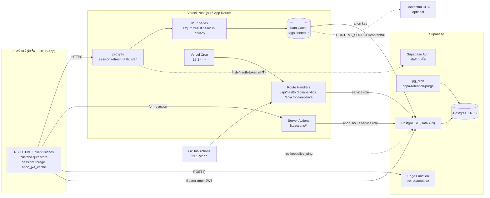
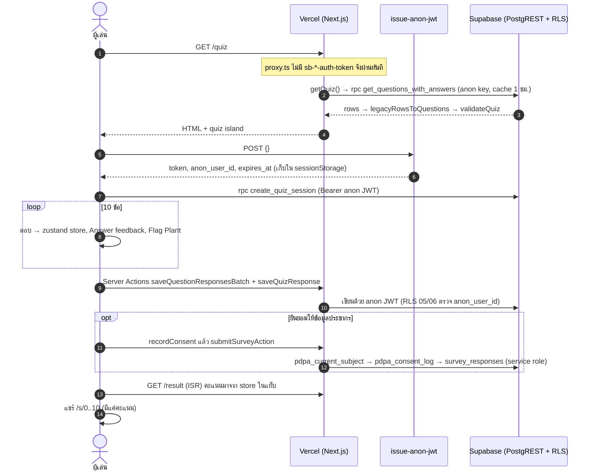

# สแกนโจร.online — Greenfield architecture

เอกสารชุดนี้เก็บ Architecture Decision Records (ADR) ของการเขียนใหม่ สแกนโจร.online
(แบบทดสอบรู้เท่าทันมิจฉาชีพ โดยธนาคารแห่งประเทศไทย และกองทุนพัฒนาสื่อปลอดภัยและสร้างสรรค์)
บน branch `claude/sharp-heisenberg-ibznti`

- ทุกข้อความที่พูดถึงโค้ดอ้างอิงไฟล์จริงใน repo ณ 2026-09-28 ถ้าแก้โค้ดที่ ADR อ้างถึง ให้แก้ ADR ในคอมมิตเดียวกัน
- Design + motion spec ("Scan & Flag") อยู่ใน Design System artifact; token ในโค้ดอยู่ที่ `app/globals.css` และ `lib/motion/tokens.ts`

| ADR | เรื่อง | สถานะ |
| --- | --- | --- |
| [ADR-001](./ADR-001-architecture-and-framework.md) | Framework, rendering strategy, state, โครงสร้างโฟลเดอร์ | Accepted |
| [ADR-002](./ADR-002-motion-and-transitions.md) | Motion (`motion/react`), 8 moments, Scan Wipe, performance budget | Accepted |
| [ADR-003](./ADR-003-content-scaling.md) | Content model, ContentSource adapters, cache, การเพิ่ม quiz / scenario | Accepted |
| [ADR-004](./ADR-004-seo-and-user-features.md) | Metadata, sitemap/robots, OG images, JSON-LD, /learn, /s, a11y, CWV | Accepted |
| [ADR-005](./ADR-005-anonymous-security.md) | Threat model ผู้ใช้นิรนาม, anon JWT, headers/CSP, ขั้นต่อไป | Accepted (มีงานค้าง) |
| [ADR-006](./ADR-006-pdpa.md) | PDPA: ความยินยอม, ROPA, retention, สิทธิเจ้าของข้อมูล | Accepted (รอฝ่ายกฎหมาย) |
| [ADR-007](./ADR-007-supabase-keepalive.md) | กัน Supabase free tier pause (Vercel Cron + GitHub Actions) | Accepted |

## ดู preview ในเครื่อง (ไม่ต้องมี Supabase)

1. `pnpm install`
2. `cp .env.example .env.local` แล้วเว้นค่า Supabase ว่างไว้
3. `pnpm dev` แล้วเปิด http://localhost:3000

เมื่อไม่มี Supabase env:

- `proxy.ts` → `utils/supabase/middleware.ts` ข้ามการ refresh session: หน้า public โหลดโดยไม่มี network call, `/mgmt-portal` redirect ไป `/login`
- `lib/content/index.ts` เลือก `fixture` source (SAMPLE 10 ข้อใน `lib/content/fixture-source.ts`) เมื่อ `NODE_ENV !== "production"`
- dev ได้ CSP แบบผ่อน (`'unsafe-eval'`, `ws:`) และไม่ส่ง HSTS / `X-Frame-Options` จึง preview ผ่าน LAN หรือ iframe ได้ (`lib/security/csp.ts`)
- หน้า `/`, `/learn`, `/s/[score]`, `/privacy`, `/result` เปิดได้; การบันทึกคำตอบ, survey และการลบข้อมูลต้องมี Supabase
- ข้อจำกัด: `/quiz` ยังเรียก `fetchQuizQuestions()` (`lib/actions/questions.ts`) ซึ่งต้องมี Supabase จนกว่าจะย้ายไป `getQuiz()` (Phase 1 ด้านล่าง)

## Target architecture



## โครงสร้างโฟลเดอร์ (ส่วนที่ greenfield ใช้)

```text
app/
  layout.tsx                 root: fonts, metadata, site JSON-LD, <MotionProvider>
  (main)/                    เว็บสาธารณะ; layout.tsx ครอบ <ScanTransitionProvider>, template.tsx = enter animation
    page.tsx                 landing (static RSC)
    quiz/ result/ survey/    flow หลัก (result = ISR 1 ชม. + client island)
    learn/ s/[score]/        คลังความรู้ + หน้าแชร์คะแนน (SSG)
    privacy/                 ประกาศความเป็นส่วนตัว + ถอนความยินยอม / ลบข้อมูล
  (admin)/mgmt-portal/       ระบบหลังบ้าน (ของเดิม, force-dynamic)
  api/health, api/cron/keepalive, api/analytics/*
  robots.ts sitemap.ts manifest.ts opengraph-image.tsx
components/ds/               Design System "Scan & Flag" (cva + semantic tokens)
components/motion/           MotionProvider, ScanTransition (Scan Wipe), ScanReveal
components/share/            ปุ่มแชร์ (Web Share, LINE, Facebook, คัดลอกลิงก์)
lib/content/                 content model + sources (Supabase / Contentful / fixture) + learn articles
lib/motion/                  tokens.ts + presets.ts (quiz-motion.ts = legacy ห้าม import ใหม่)
lib/privacy/                 policy.ts (single source of truth PDPA), survey schema, identity, rate limit
lib/security/                csp, require-admin, admin-policy, cron-auth, safe-redirect, responses
lib/seo/                     site, metadata, JSON-LD, OG kit, share paths
lib/actions/                 Server Actions (privacy.ts, survey.ts ใหม่; ที่เหลือเป็นของเดิม)
store/quiz-store.ts          zustand: state ของ quiz ที่กำลังเล่นเท่านั้น
supabase/migrations/         01–06 ของเดิม, 07–09 ของ greenfield
supabase/functions/issue-anon-jwt/
__tests__/<domain>/          content, privacy, security, seo, share, survey, result, ds
```

## Request / data flow: เล่น quiz หนึ่งรอบ



หมายเหตุ: ขั้น `getQuiz()` คือเป้าหมาย; ณ วันที่เขียน `app/(main)/quiz/page.tsx` ยังเรียก `fetchQuizQuestions()` (อ่าน cookies จึงเป็น dynamic และไม่ cache) ส่วน `/result` ใช้ `getQuiz()` แล้ว

## สิ่งที่ branch นี้ส่งมอบ vs. ขั้นต่อไป

**ส่งมอบแล้ว**

- Design tokens + DS components 14 ไฟล์ใน `components/ds/`, motion foundation (`lib/motion/*`, `components/motion/*`)
- หน้าใหม่: landing, `/result`, `/survey`, `/learn` (6 บทความ), `/s/[score]`, `/privacy`, `/error`
- Content layer (`lib/content/*`) + migration 09
- SEO: metadata ต่อหน้า, `robots.ts` ตาม host, `sitemap.ts`, `manifest.ts`, OG images ภาษาไทย, JSON-LD
- Security: CSP + security headers ทุก response, `/api/analytics/*` ต้องเป็น admin, `/api/health`, proxy แบบ fail-soft
- PDPA: `lib/privacy/policy.ts`, consent log + retention purge + erasure (migration 08), Server Actions ใหม่
- Keep-alive: migration 07, `/api/cron/keepalive`, `vercel.json` cron, `.github/workflows/supabase-keepalive.yml`

**Roadmap**

| Phase | งาน | อ้างอิง |
| --- | --- | --- |
| 1 (ต่อทันที) | ย้าย `/quiz` ไป `getQuiz()` + DS components + scenario renderer registry; ลบ `framer-motion` imports ที่เหลือ | ADR-001, 002, 003 |
| 1 | เรียก `revalidateQuizContent()` จาก Server Actions ของ admin หลังแก้คำถาม | ADR-003 |
| 1 | ใช้ `safeRedirectPath()` ใน `app/(main)/login/action.ts`; ใช้ `ADMIN_EMAILS` ใน admin layout ด้วย | ADR-005 |
| 1 | ตรวจ path Edge Function (`/functions/v2/` ในโค้ด) และสถานะ RLS ของ `questions` / `answers` ใน production | ADR-005 |
| 2 | Supabase Anonymous Sign-Ins + Turnstile แทน `issue-anon-jwt`; ย้ายการคิดคะแนนไป server | ADR-005 |
| 2 | Vercel Firewall rate limit, nonce CSP, หมุน key | ADR-005 |
| 2 | กรอก `CONTROLLER` (TODO(legal)), DPA กับ Supabase/Vercel, ตั้ง region สิงคโปร์ | ADR-006 |
| 3 | `/quiz/[slug]` หลายแคมเปญ, scenario kind `chat` / `call` / `sms`, i18n `en` | ADR-003 |
| 3 | backlog ฟีเจอร์ผู้ใช้ (ADR-004) | ADR-004 |

## Setup checklist

**Environment variables (Vercel → Project Settings → Environment Variables)** ดูคำอธิบายเต็มใน `.env.example`

| ตัวแปร | ที่ใช้ | หมายเหตุ |
| --- | --- | --- |
| `NEXT_PUBLIC_SITE_URL` | `lib/seo/site.ts` | ตั้งบน Production เสมอ (default คือโดเมนจริง) |
| `NEXT_PUBLIC_SUPABASE_URL`, `NEXT_PUBLIC_SUPABASE_PUBLISHABLE_DEFAULT_KEY` (หรือ `NEXT_PUBLIC_SUPABASE_ANON_KEY`) | clients ใน `utils/supabase/*` | browser-safe |
| `SECRET_KEY` | `utils/supabase/admin.ts` (`server-only`) | ห้ามขึ้นต้นด้วย `NEXT_PUBLIC_` |
| `CRON_SECRET` | `lib/security/cron-auth.ts` | ≥ 16 ตัวอักษร (`openssl rand -hex 32`) |
| `ADMIN_EMAILS` | `lib/security/admin-policy.ts` | แนะนำให้ตั้งใน production |
| `GOOGLE_SITE_VERIFICATION` | `app/layout.tsx` | ไม่บังคับ |
| `CONTENT_SOURCE`, `CONTENTFUL_*` | `lib/content/index.ts`, `contentful-source.ts` | ไม่ตั้ง = auto |

**Supabase**

- Apply migrations ตามลำดับ `07-keepalive.sql` → `08-pdpa-consent-retention.sql` → `09-content-model.sql` (ทุกไฟล์ idempotent)
- 08 ต้องมี extension `pg_cron` และต้อง deploy พร้อม `lib/actions/survey.ts` (หลัง 08 role anon/authenticated เขียน `survey_responses` ตรงไม่ได้); backup ก่อน เพราะ purge รอบแรกจะ roll up + ลบข้อมูลประชากรเก่ากว่า 12 เดือน
- Edge Function secrets: `ANON_JWT_SECRET` (project JWT secret), `TOKEN_TTL_SECONDS`
- ตรวจ: `select * from cron.job where jobname = 'pdpa-retention-purge';`

**Vercel**

- Cron จาก `vercel.json` (`17 3 * * *` = 10:17 น. เวลาไทย) ทำงานเฉพาะ Production deployment และส่ง `Authorization: Bearer $CRON_SECRET` ให้เอง
- ตั้ง Function Region ให้ใกล้ Supabase (แนะนำ `sin1` ถ้า Supabase อยู่สิงคโปร์) ดู ADR-006

**GitHub Actions secrets** (Settings → Secrets and variables → Actions)

- `KEEPALIVE_URL` = `https://<โดเมน>/api/cron/keepalive`, `CRON_SECRET` (ค่าเดียวกับ Vercel)
- ไม่บังคับ: `SUPABASE_URL`, `SUPABASE_SERVICE_ROLE_KEY` สำหรับ ping ฐานข้อมูลตรง

**ตรวจก่อน merge**: `pnpm type-check`, `pnpm lint`, `pnpm test`
